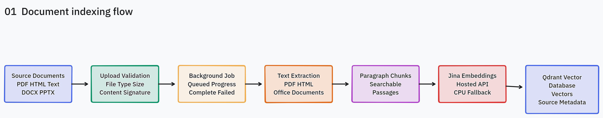
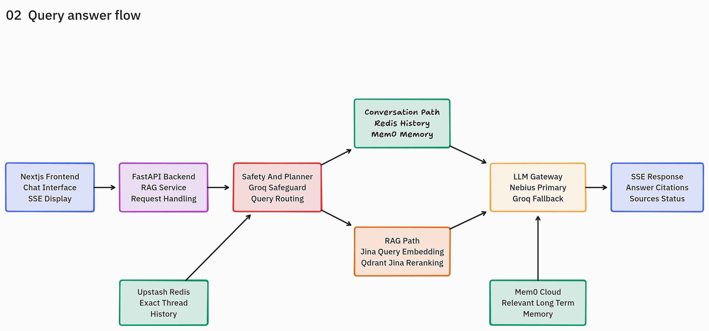
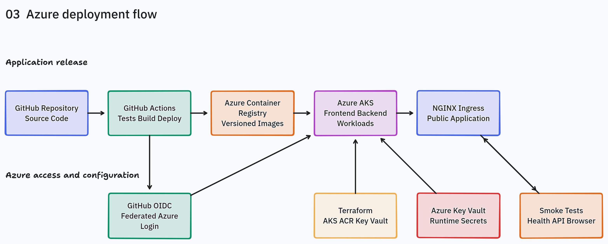
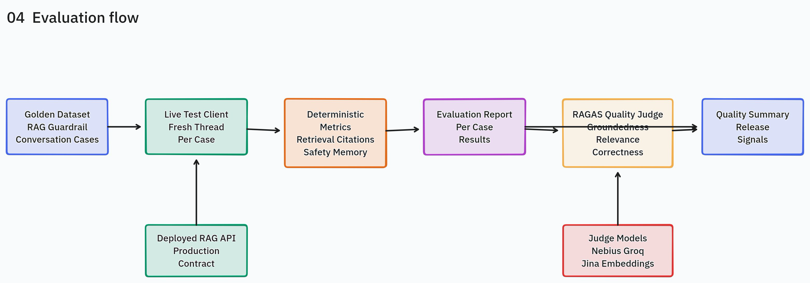

# Enterprise Agentic RAG

A streaming enterprise RAG assistant for approved Kubernetes, Intel hardware, and networking knowledge.

## What it uses

- **Backend:** FastAPI, LangGraph-compatible pipeline, Qdrant retrieval, Jina embeddings/reranking
- **LLM routing:** Nebius `google/gemma-3-27b-it` primary → Groq `llama-3.3-70b-versatile` fallback
- **Safety:** Groq `openai/gpt-oss-safeguard-20b` policy classifier by default; NeMo remains rollback-only
- **Memory:** Redis exact recent thread history + Mem0 semantic long-term memory
- **Frontend:** Next.js same-origin proxy; backend API key stays server-side
- **Observability:** Logfire/LangSmith optional traces, Prometheus metrics
- **Evaluations:** deterministic live checks + optional RAGAS quality scoring

## Architecture

The editable source is [enterprise-rag-architecture.tldraw](architecture/enterprise-rag-architecture.tldraw).

### Document Indexing

[](architecture/images/01-document-indexing.png?raw=true)

### Query Answer Flow

[](architecture/images/02-query-answer-flow.png?raw=true)

### Azure Deployment

[](architecture/images/03-azure-deployment.png?raw=true)

### Evaluation

[](architecture/images/04-evaluation.png?raw=true)

## Documentation

| Topic | Guide |
|---|---|
| Local Python/Node setup, health checks, API examples, ingestion, tests | [docs/local-setup.md](docs/local-setup.md) |
| Local Docker images and Docker Compose smoke tests | [docs/docker.md](docs/docker.md) |
| Deterministic evals, RAGAS, guardrail A/B, current baseline | [docs/evaluations.md](docs/evaluations.md) |
| Local Kubernetes and Azure AKS deployment | [docs/kubernetes.md](docs/kubernetes.md) |
| Azure bootstrap, platform Terraform, and Key Vault migration | [docs/terraform.md](docs/terraform.md) |
| GitHub OIDC, CI, ACR push, and AKS deployment | [docs/github-actions.md](docs/github-actions.md) |
| CI/CD and AKS deployment issues encountered | [docs/ci-cd-issues.md](docs/ci-cd-issues.md) |
| Deployment roadmap and production hardening | [docs/deployment-roadmap.md](docs/deployment-roadmap.md) |

## Azure AKS deployment

The validated cloud path uses Azure ACR, AKS, Key Vault, Workload Identity,
and GitHub Actions OIDC. Follow the [Terraform guide](docs/terraform.md) for
infrastructure and secret migration, then the [GitHub Actions guide](docs/github-actions.md)
for environment configuration, image deployment, verification, and teardown.
The CI workflow can also be started manually to validate backend, frontend, and
Kubernetes changes without deploying Azure resources.

The cloud validation deployment does not require a purchased domain. Terraform
uses the local hostname `enterprise-agentic-rag.test`; after deployment, map the
Ingress IP in `/etc/hosts` and open `http://enterprise-agentic-rag.test/`.
The complete setup, verification, and teardown sequence is in
[docs/github-actions.md](docs/github-actions.md). The non-obvious deployment
failures and their fixes are recorded in [docs/ci-cd-issues.md](docs/ci-cd-issues.md).

The disposable Azure test resources were destroyed after validation. The
Terraform and GitHub Actions guides reproduce the deployment when another
cloud test run is needed.

## Quick start: local dev

```bash
uv sync --extra dev
cp .env.example .env
# Edit .env with real service credentials.

cd ui
npm install
cp .env.example .env.local
cd ..
```

Run backend and frontend:

```bash
# terminal 1
uv run uvicorn app.main:app --reload --port 8000

# terminal 2
cd ui && npm run dev
```

Open [http://localhost:3000](http://localhost:3000).

## Quick start: Docker

```bash
fuser -k 8000/tcp 3000/tcp || true
DOCKER_RATE_LIMIT_PER_MINUTE=100 docker compose up --build
```

Open [http://localhost:3000](http://localhost:3000).

Smoke checks:

```bash
curl http://localhost:8000/health
curl http://localhost:3000/api/rag/health
```

Details: [docs/docker.md](docs/docker.md).

## Tests

```bash
uv run pytest
uv run ruff check app evals tests
cd ui && npm test && npm run build
```

## Evaluations

Deterministic live evals:

```bash
RATE_LIMIT_PER_MINUTE=100 uv run uvicorn app.main:app --reload --port 8000
uv run python -m evals.run
```

RAGAS from the saved deterministic report, using Nebius judge credits:

```bash
uv run python -m evals.run \
  --ragas-from-report evals/latest_report.json \
  --judge-provider nebius \
  --judge-delay 10 \
  --ragas-score-timeout 180
```

Details and troubleshooting: [docs/evaluations.md](docs/evaluations.md).

## Current evaluation baseline

Latest validated baseline from the Dockerized local stack:

| Metric | Score |
|---|---:|
| RAG retrieval rate | 1.000 |
| Expected source recall | 1.000 |
| Citation coverage | 1.000 |
| Citation validity | 1.000 |
| Required term recall | 1.000 |
| Guardrail precision/recall/accuracy | 1.000 / 1.000 / 1.000 |
| Conversation pass rate | 1.000 |
| RAGAS faithfulness | 0.969 |
| RAGAS answer relevancy | 0.890 |
| RAGAS context precision | 0.935 |
| RAGAS context recall | 0.938 |
| RAGAS answer correctness | 0.712 |

Interpretation: retrieval, citations, guardrails, and conversation memory are passing strongly. The main quality-improvement target is answer correctness/detail alignment while preserving high faithfulness.

## Current operational limitations

- Upload job state uses in-process memory and FastAPI background tasks. Replace it with a durable worker queue before multi-worker production deployment.
- `RAG_API_KEY` is service authentication, not user authentication or tenant isolation. Add identity, authorization, and tenant-scoped data access before production.
- The approved-domain guardrail policy is authoritative. Ingesting a document does not authorize a new domain.
- The current cloud validation target is a disposable Azure AKS deployment; it uses a local `.test` hostname and does not provide public DNS or production identity/tenant isolation.
- The AKS test cluster uses one small system node and the backend uses a `Recreate` rollout strategy to avoid requiring temporary CPU for two backend pods. This can cause a short backend interruption during deployment; use multiple appropriately sized nodes and a rolling strategy before production use.
